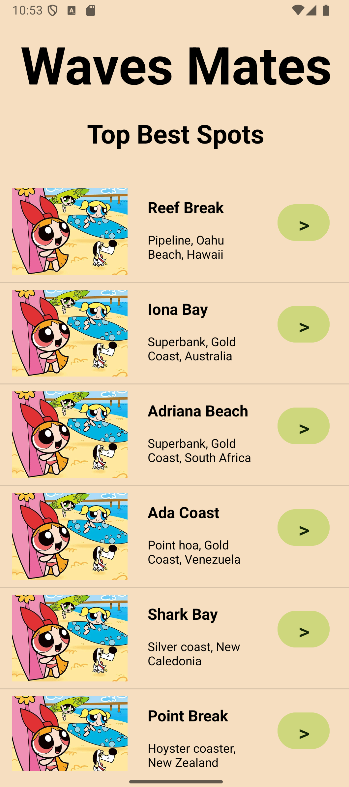

# projet-collectif-waves-mates
### Contexte
Projet collectif réalisé dans le cadre de ma formation Concepteur Développeur D'Applications chez Ada Tech School. 
Équipe de 3 personnes - 8 jours. 

### Projet
Application mobile référençant la liste des meilleurs spots de surfs autor du monde.

### Technos
FRONT : Kotlin 
BACK : Go 

### MVP 
Les activités du Front sont relié au Back par une Api créée en Go.

	<kbd></kbd>&nbsp;
	</kbd>

